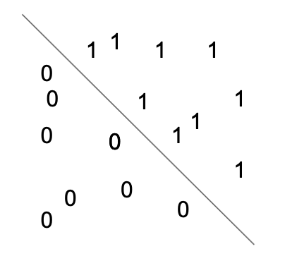
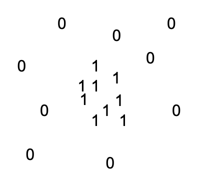

# Classification with logistic regression

We turn now to the task of classification as told from the perspective of the most basic, common, and widely known linear classifier: logistic regression. Let us begin by recalling the classification task:

In this setting, we are given (most likely) noisy and partial access to a function $f: X \to \{0, 1\}$ via a data set $D = \{(x_1, y_1), \dots , (x_n, y_n)\}$ where $y_i$ is a noisy proxy for $f(x_i)$. Our goal is to learn a function that is similar to $f$ on new data.

Similarity is often formalized in the opposite sense (dissimilarity) as a "loss" function. That is, $L(g(x), f(x)) \geq 0$ and $L(g(x), f(x)$ approaches $0$ as $g(x)$ approaches $f(x)$. The learning process to produce $g$ can generally be conceptualized as an optimization process where we seek to minimize $\sum_{x \in D} L(\cdot, f(x))$ over some function space $F$. In the case of logistic regression, we will be using the principle of maximum likelihood to fit our model, so we will actually be maximizing a notion of similarity.

That said, there are many practical concerns that exist when learning models in practice. The goal of this lecture is to introduce the concept of logistic regression formally and develop an intuition for how the model behaves and when it is appropriate. We will then be well suited to gain practical experience fitting our own logistic regression models in the practical portion of today's class.

## What is logistic regression?

The idea with logistic regression is that you will attempt to divide the negative class from the positive class in your data with a codimension 1 hyperplane in your feature space. Let's consider a small example in a 2-dimensional feature space:

Now let's look at another example:

As we see from the examples above, it is certainly possible that the two classes need not be linearly separable. Indeed, in practice this is almost never the case. What are we to do then? What linear subspace should we choose? From the grand introduction to classification problems, we know that we should stop and ask what our notion of loss or gain should be.

Let us now formalize the function space that logistic regression considers as well as how we will judge logistic regressions.

The specification of the logistic regression space comes from modeling the log-odds of teh event in question as a linear function:

$$\log \left( \frac{Pr(Y=1 | X=x)}{Pr(Y=0 | X=x)} \right) = \beta^Tx$$

From this we can make our way (as an exercise to the reader) to the form:

$$Pr(Y=1 | X=x) = \frac{1}{1 + \exp{-\beta^Tx}}$$

### Exercises
1. When $\beta^Tx >> 0$, what is $Pr(Y=1 | X=x)$ close to?
2. When $\beta^Tx << 0$, what is $Pr(Y=1 | X=x)$ close to?
3. When $\beta^Tx = 0$, what is $Pr(Y=1 | X=x)$ equal to?
4. Draw the function $f(t) = \frac{1}{1 + \exp(-t)}$?

So, given this particular specification of our function space, that is, all functions of the form

$$g(x) = \frac{1}{1+\exp{-\beta^Tx}}$$

how do we measure how bad or good this function is? One natural choice in cases like this, where we produce probabilities to be evauated against historical classification data is the principle of maximum likelihood. Specifically, that the probabilities produced by our logistic regression function should maximize the likelihood of the actual data we have observed.

So, how likely is the data ${(x_i, y_i)}^N_{i=1}$ if $Pr(Y=y_i | X=x_i) = g(x)$? Well, it is straightforward to compute that this likelihood is:

$$\prod^N_{i=1} [y_ig(x_i) + (1-y_i)(1-g(x_i))]$$

But maximizing this quantity is the same as maximizing it's log (since log is a monotone increasing function. Thus, we may instead seek to maximize:

$$\sum^N_{i=1} y_i\log{g(x_i)} + (1-y_i)\log{1-g(x_i)}$$

So, we see that the logistic regression model fitting process amounts to searching the space of all logistic regression function and finding the one where the above quantity is maximized.
